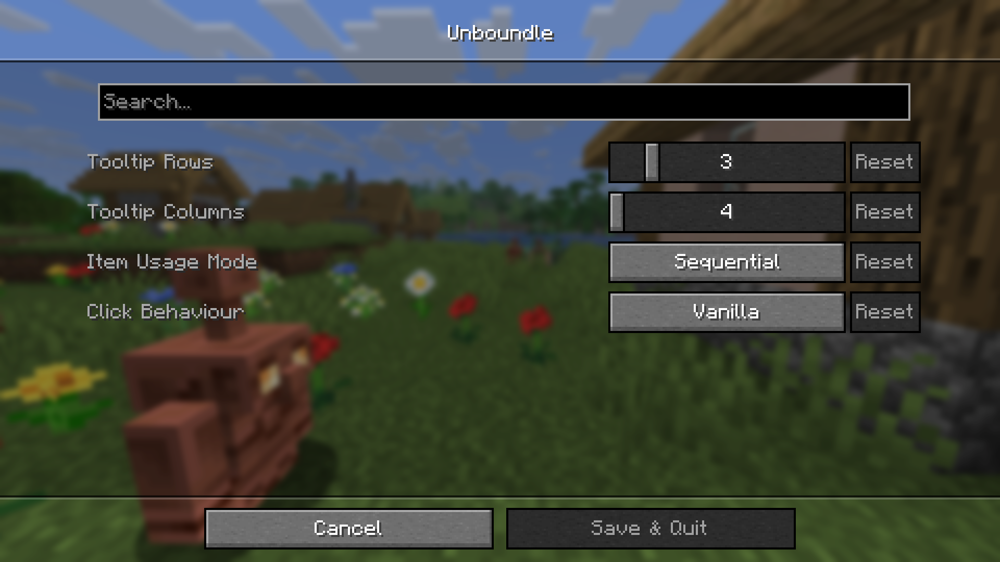

# Overview

This mod expands the bundle into a fully functional multi-item stack.
Use items directly out of the bundle and organize your inventory more easily, all while preserving a vanilla feeling.

---

# Features

## Improved tooltip

With the new tooltip, you can now:
- Adapt the tooltip dimensions to your liking.
- Scroll past the initial window to access all items in the bundle.
- Insert items at any position.

To keep the inventory clean, you can now also store four unstackable items in a bundle.

  
<strong>See the tooltip in action</strong>

Additionally, there's now a ModMenu setting to control how left and right click interact with the bundle.

  
<strong>Show settings</strong>

## Item usage out of bundles

Use almost any item right out of the bundle! That includes block placement, projectile throws, material application, tool usage, and more.

Combine that with the keybind toggle to switch between sequential and random item usage.

  
<strong>See item usage in action</strong>

Insert items as a separate stack with a shift-click, and take advantage of recursive bundles to go insane with item distribution!

  
<strong>See recursive bundles in action</strong>

The drop key now drops the items out of the bundle, and CTRL & drop drops the bundle item itself.

Want to automate emptying bundles? Droppers can now look inside bundles and drop their contents.

## Unsupported items

There are a few items that are not supported for item usage. 
Any other item works out of the bundle.

  
<strong>Show unsupported items</strong>

    - Any consumables, such as food or drinkable potions.
    - Bows and Crossbows
    - Tridents
    - Shields
    - Brushes
    - Spyglasses
    - Fishing rods, including carrot / warped fungus on a stick
    - Writable books

---

# Installation

Download the .jar file and put it in the /mods folder inside your /.minecraft directory.

---

# Dependencies

---

# Contribution

Bug reports and feature requests are welcome on GitHub.

---

# License

Copyright © 2026 [Skyros4](https://github.com/Skyros4/)

This project is licensed under the [LGPL-3.0 License](LICENSE).
